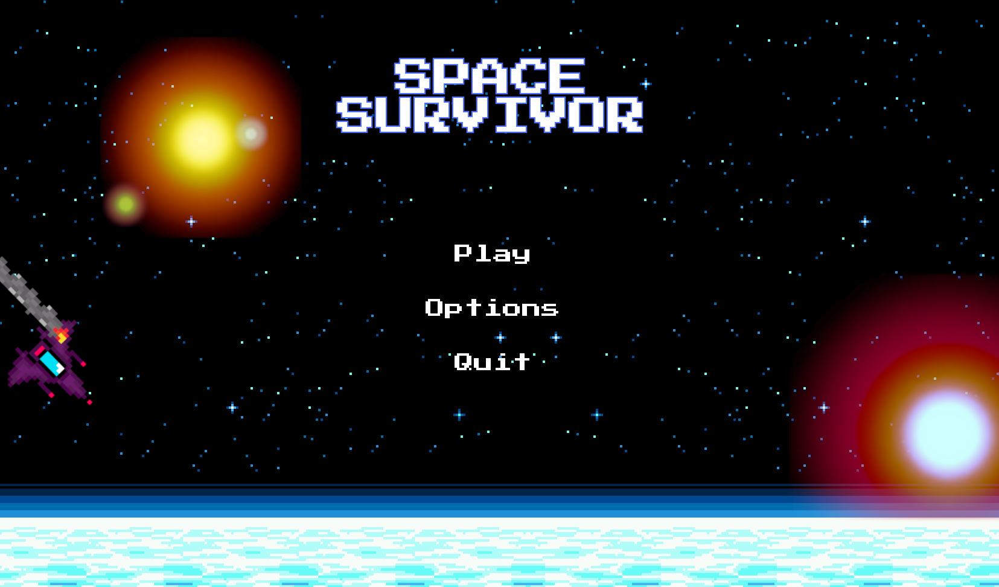

# 🌌 **Space Survivor** 🌌

**_An epic pixel art journey through the cosmos, where survival is your only mission!_**

<div align="center">
  
  <br>
  <em>An exclusive glimpse into your galactic adventure!</em>
</div>

---

## 🚀 **About the Project**

**Space Survivor** is a 2D survival game set in a retro pixel art universe. Face endless waves of cosmic monsters while upgrading your arsenal. With each level, challenges intensify, testing your strategy and reflexes to the limit.

🌠 **Key Features:**

- Retro-inspired pixel art graphics.
- Dynamically generated endless monster waves.
- Progression system to unlock weapons and enhance your skills.
- Immersive space-themed soundtrack.

---

## 🎮 **Gameplay Overview**

> **Objective:** Survive as many waves as possible! Collect bonuses, upgrade your weapons, and confront epic bosses!

---

# 💾 **Installation and Launch Guide**

### 📋 **Prerequisites**

Ensure you have the following installed on your machine:

- [Docker](https://www.docker.com/)
- Java (JDK 17 or higher)
- Gradle

### 🚀 **Launching the Project**

1. **Clone the repository:**

   ```bash
   git clone <git@github.com:EpitechMscProPromo2027/T-JAV-501-REN_3.git>
   cd T-JAV-501-REN_3
   ```

## Start the Docker environment:

**Navigate to the docker directory**

```bash
cd docker
Run docker compose up
```

**Once Docker is up and running, return to the root directory**

```bash
cd ..
```

**Run the game**

Execute Gradle to launch the project:

```bash
sudo ./gradlew run
```

**Enjoy the game! 🌟**

## 📜 Credits

- Developed by: Maxim, Yannis and Theo. At Epitech Rennes.

Join the cosmic adventure! 🚀
